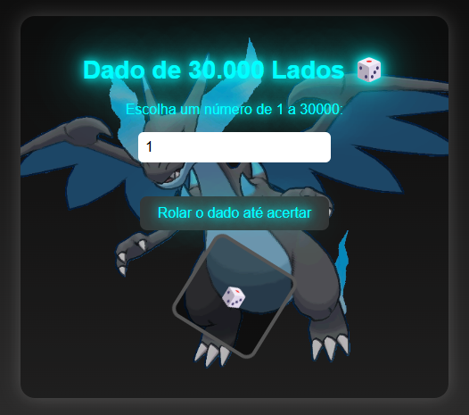
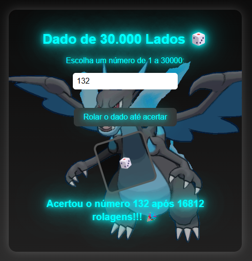

# 🎲 Dado de 30.000 Lados - Simulador de Shiny Pokémon

Este é um projeto simples e divertido que simula a emoção de encontrar um **Pokémon Shiny** usando um "dado" de 30.000 lados.

## 🧠 Ideia por trás do projeto

Inspirado na raridade de encontrar um Pokémon Shiny, que em muitos jogos tem uma chance de 1 em 4.096 ou até menor, aqui a chance é ainda mais extrema: **1 em 30.000**! Você escolhe um número entre 1 e 30.000, e o sistema começa a rolar um dado virtual até cair exatamente o número escolhido. Quantas rolagens será que vai demorar?

## ⚙️ Como funciona

- O usuário digita um número entre `1` e `30.000`.
- Ao clicar em **"Rolar o dado até acertar"**, o programa começa a gerar números aleatórios até encontrar o número escolhido.
- Um contador mostra **quantas tentativas** foram necessárias para "acertar" o número.
- Quando o número aparece, a animação do dado para e uma mensagem de sucesso é exibida!

## ✨ Recursos Visuais

- Interface com efeitos **neon** e **animação rotacional** no dado.
- Fundo animado com **Charizard Shiny** para reforçar a temática Pokémon.
- Feedback visual que simula a rolagem do dado e a emoção da espera.

## 💻 Tecnologias Utilizadas

- [HTML5](https://developer.mozilla.org/pt-BR/docs/Web/HTML)
- [CSS3](https://developer.mozilla.org/pt-BR/docs/Web/CSS)
- [JavaScript](https://developer.mozilla.org/pt-BR/docs/Web/JavaScript)

## 📷 Capturas de Tela

  
  

## 🔧 Possíveis melhorias futuras

- Adicionar barra de progresso animada durante a rolagem.
- Permitir escolher a quantidade de lados do dado.
- Simulação automática de várias tentativas (como uma caça de múltiplos Shinies).
- Sons e efeitos visuais para reforçar a experiência.

---

Feito com 💙 por **Aziien**
